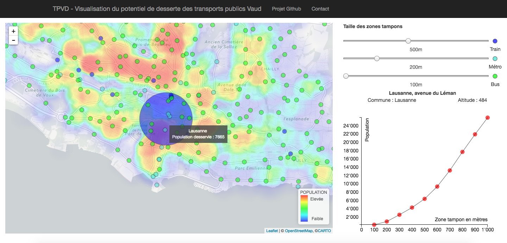
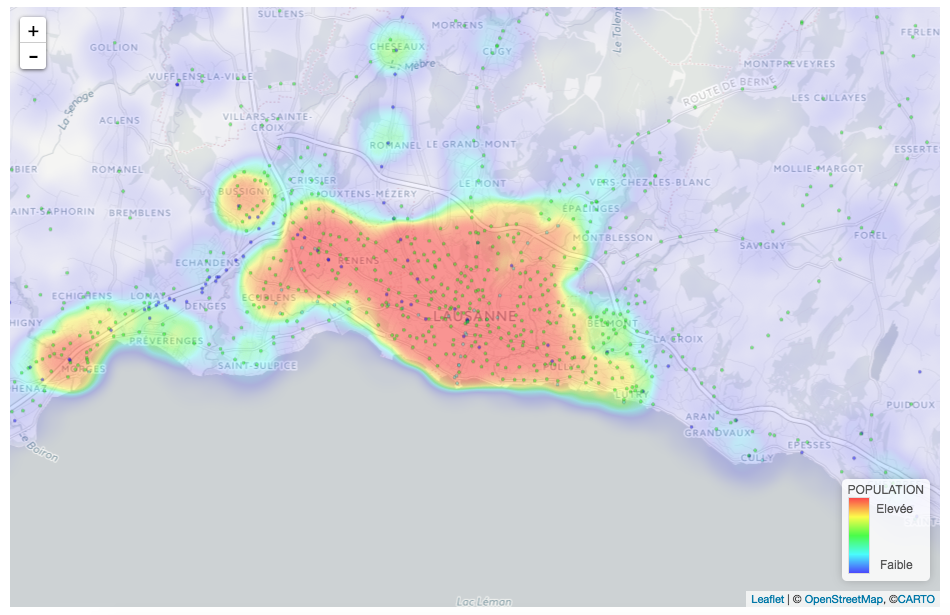
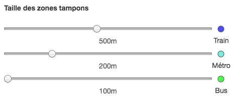
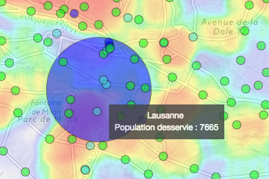
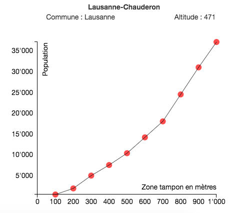

# TPVD
*TPVD v 1.0* disponible en ligne [ici](https://nvlm.github.io/)

  Projet effectué dans le cadre du cours : *Visualisation de données* de Isaac Pante (Faculté des Lettres, Université de Lausanne, SP2017) par Lucas Martinez et Nicolas Vallotton

## Description
**TPVD** (pour *Transports Publics Vaud*) est une application de cartographie interactive qui permet de visualiser dynamiquement la desserte des arrêts de transport publics dans le canton de Vaud (Suisse).



### Principe
##### Des zones tampons selon 3 catégories
**TPVD** permet de visualiser la population potentiellement desservie par l'ensemble des arrêts de transport du canton de Vaud selon différents scénarios : pour chaque arrêt, il est possible d'afficher une zone tampon (correspondant à l'aire de desserte de chaque arrêt) en fonction d'un rayon défini par l'utilisateur. Partant de l'hypothèse selon laquelle *l'attractivité des arrêts est proportionnelle aux opportunités de déplacement qu'ils offrent*, les arrêts sont séparés selon trois catégories (trajets de courte, moyenne et longue distance).

- La catégorie **train** est considérée comme offrant les trajets de longue distance. Elle comporte donc toutes gares ferroviaires.
- La catégorie **métro** offre une desserte de distance moyenne. Elle comporte tous les arrêts de métro, bateau ou encore de funiculaire.
- La catégorie **bus** offre une desserte de courte distance. Elle comporte tous les arrêts de bus.

*NB:* certains arrêts sont desservis par deux catégories différentes. Dans ce cas, l'arrêt est classifié dans la catégorie de desserte supérieure (*p. ex:* un arrêt comportant **train et bus** sera catégorisé comme **train**).

Les valeurs sont calculées dans le cas d'un espace uniforme ne considérant aucune contrainte physique. Il s'agit donc uniquement de considérer la population desservie pour un rayon donné *à vol d'oiseau*.

##### Un complément d'information visuelle
La population est cartographiée de manière synthétique à l'aide d'une *heatmap* (ou carte de chaleur). Cette dernière permet de distinguer les zones urbaines denses des zones moins peuplées. Pour une analyse plus fine d'un arrêt de transport, **TPVD** offre également une visualisation sous forme de graphique indiquant la population desservie en fonction des différents rayons de la zone tampon autour cet arrêt. Cette fontionnalité permet d'analyser de manière succincte l'évolution de la population desservie selon le scénario considéré.

### Public cible
**TPVD** s'adresse principalement à des profesionnels dans le domaine des transports, de l'aménagement du territoire ou à des décideurs politiques. Ces derniers peuvent avoir besoin de croiser des données sur les transports publics et de la population desservie relative à différentes distances rapidement et de manière simple afin d'apprécier la desserte globale des arrêts de transport dans différents contextes tels que

- L'analyse primaire de l'efficacité d'un arrêt/d'une ligne de transport public.
- La planification de nouvelles lignes pour des zones peu desservies.
- L'évaluation de l'attractivité de nouveaux logements par rapport à leur desserte.

## Utilisation
L'application TPVD est découpée en deux grandes parties

- La carte sur la gauche
- Les *sliders* et le graphique sur la droite

### Carte

La carte est composée de 3 éléments:

- Un fond de carte "light" *openstreetmap* qui permet de se répérer géographiquement sur la carte
- Une *heatmap* représentant la densité de population. Elle donne une indication globale sur la densité de population pour permettre de distinguer les zones densément peuplées
- Les arrrêts de transport publics sous forme de points. Ils sont divisés en trois catégories permettent d'apprécier leur répartition selon différentes zones tampons circulaires.



Il est possible de naviguer sur cette carte (*panning*) et de changer le niveau de zoom en fonction du niveau de détail voulu par l'utilisateur. L'emprise de la carte est restreinte au périmètre du canton de Vaud.

### *Sliders* et graphique

Trois *sliders* permettent de faire varier la taille des zones tampons autour des arrêts de transport pour chacune des trois catégories. Les valeurs peuvent varier entre 100m et 1000m par incréments de 100m.

Les paramètres initiaux sont.

- 100m pour les bus
- 200m pour le métro
- 500m pour le train



Lorsque l'on place le curseur sur un arrêt de transport, la taille du cercle  augmente en fonction de la taille de la zone tampon choisie. Une indication sur le nom de l'arrêt et de la population habitant à l'intérieur de la zone prédéfinie va s'afficher.



Si l'utilisateur clique sur un arrêt de transport, un graphique va apparaître dans la section en bas à droite de page. Ce graphique affiche l'évolution de la population pour les différents rayons de zone tampons considérés. Lorsque le curseur est placé sur l'un des points, la valeur exacte de population desservie est affichée.



## Ressources

#### Données
Les données de la population proviennent du *"nouveau recensement, population, ménages privés: géodonnées"* sont disponibles en ligne sur [le site de l'office fédéral de la statisqtiques (OFS)](https://www.bfs.admin.ch/bfs/fr/home/actualites/quoi-de-neuf.assetdetail.1442443.html)

Les données concernant les arrêts de transport publics proviennent des géodonnées de l'Office fédéral des transports (OFT) [disponibles en ligne](https://www.bav.admin.ch/bav/fr/home/themes/liste-alphabetique-des-sujets/geoinformation/geodonnees-de-base/arrets-des-transports-publics.html)

#### Traitement

Les principales étapes accomplies sur les données :

- Suppression des données inutiles
- Sélection par attribut des données concernant le canton de Vaud (volume de données trop important pour la Suisse entière)
- Optimisation des données au format *CSV* (réduction des temps de chargement)
- Synthèse de l'information de la population (*heatmap*) pour des raisons de lisibilité et de temps de chargement
- Calcul de la population dans la zone tampon d'un arrêt de transport pour chaque rayon à l'aide de la requête suivante (*PostGIS*)

```
CREATE TABLE buffer100 AS SELECT pts_wgs.numero, sum(hect.b14btot) FROM pts_wgs LEFT JOIN hect ON ST_DWithin(pts_wgs.geom::geography, hect.geom::geography, 100) GROUP BY pts_wgs.numero;
```

Avec

- *buffer100* étant la table des valeurs de la population desservie pour une zone tampon de 100m
- *pts_wgs.numero* les arrêts de transport par identifiant dans la table des points des arrêts de transport
- *hect.b14btot* l'attribut de population au sein de la table de la population par hectare

## Licence

Ce programme est un logiciel gratuit.

**TPVD** a été développé avec les librairies suivantes :

- Bootstrap 3.3.7
- Jquery 3.2.1
- Leaflet 0.7.7
- Leaflet-heat
- D3 3.5.17
- D3SvgOverlay

Le fond de carte utilisé provient de [cartoDB](https://cartodb-basemaps)

Certaines libraries et données utilisées pour le développement sont parfois soumis à un copyright par leurs auteurs respectifs.

---------

Copyright © 2017 - l'équipe de développement de TPVD : Lucas Martinez - Nicolas Vallotton
